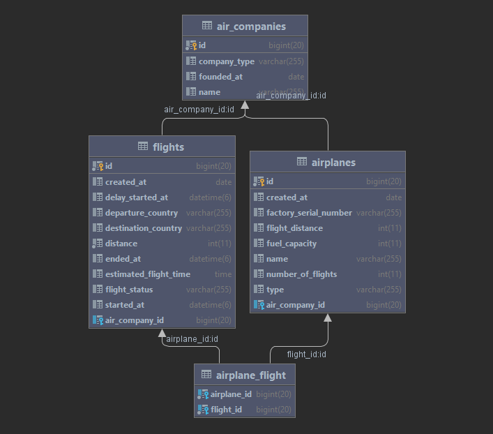

     postman url: `https://www.getpostman.com/collections/ca882c02740b6e4763c2`
     
     Also, you have postman collection in: `src/main/resources/data/New Collection.postman_collection.json`
    
     Docker Pull Command `docker pull pavlomartsiniv/air_soft` 
     
     url `https://hub.docker.com/r/pavlomartsiniv/air_soft`

## Implementation details and technologies

### Project based on 3-layer architecture:
>- Presentation layer (controllers)
>- Application layer (services)
>- Data access layer (DAO)

### Technologies
>- Spring Boot
>- MySQL
>- JSON
>- Lombok
>- Maven

### Diagram DB

## Setup
>1. run mvn clean package
>2. Install MySQL(V - 8.0)
>3. Create new schema, change name your database, password and user in application.properties